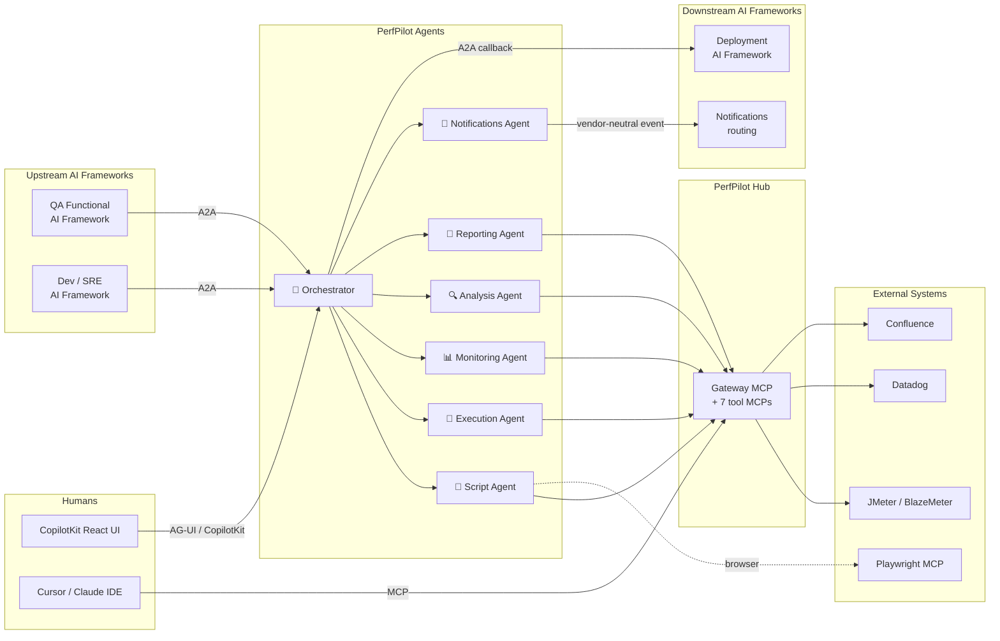
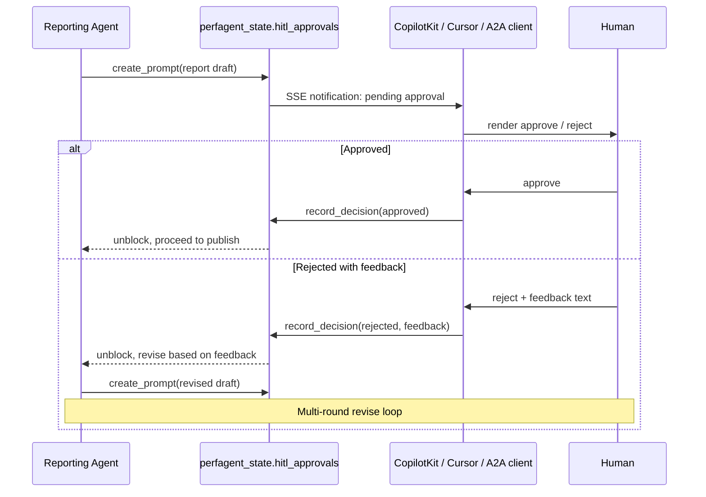

# ✈️ PerfPilot Agents

> **Your AI co-pilot for the entire Performance Testing Lifecycle — from
> test creation to results delivery, with a human at the controls when it
> matters.**

> ⚠️ **NOTE:** APIs,
> configuration schemas, and database DDL are stabilizing but may
> still change.

---

PerfPilot Agents is the **AG2-based AI agent layer** of the MCP Perf
Suite. It pairs with [**PerfPilot Hub**](../mcp-perf-suite/gateway-mcp/) (the unified
MCP gateway that exposes every performance-testing tool through a single
endpoint) to deliver the first open-source attempt at a fully-agentic,
end-to-end Performance Testing Lifecycle (PTLC) automation system —
with safe, deliberate human-in-the-loop gates at every consequential
step.

Think of it this way:

- **PerfPilot Hub** gives an AI agent *one* MCP endpoint to access
  JMeter, BlazeMeter, Datadog, Confluence, PerfMemory, and the rest.
- **PerfPilot Agents** is the squadron of specialist AI agents that
  actually flies the mission — generating scripts, executing tests,
  pulling metrics, correlating bottlenecks, writing reports, and
  delivering results, all coordinated by an orchestrator agent and all
  reachable over open protocols by other AI agent frameworks upstream
  and downstream.

---

## 🎯 What is PerfPilot Agents?

A multi-agent AI system that **autonomously runs performance tests**
while keeping humans in the loop for every consequential decision —
test launch, report approval, publication. The agents specialize by
PTLC phase, collaborate with each other, and just as importantly,
collaborate with **other AI agent frameworks** through the standard
[**A2A (Agent-to-Agent) protocol**](https://google.github.io/A2A/) —
so a QA Functional framework upstream can request a load test, and a
deployment-automation framework downstream can consume the results,
without ever knowing PerfPilot exists by name.

### 🚀 The vision

A performance test today usually means a human running through a
sequence of fragmented tools: record a script in JMeter, upload to
BlazeMeter, watch Datadog during the run, hand-correlate metrics
afterward, write a report, mail it around. PerfPilot Agents collapses
that entire pipeline into:

1. **Upstream framework** (or human in CopilotKit UI, Cursor, Claude
   IDE) submits a test request.
2. **PerfPilot Agents orchestrator** routes the work to its
   specialists.
3. **Specialists** generate the script, execute the test, pull
   monitoring data, correlate findings, and draft a report.
4. **Human reviewer** approves the report (or sends it back for
   revision — the agents iterate).
5. **Downstream framework** receives the results via webhook, A2A
   callback, or Confluence publication.

The human stays in the loop. The agents do the heavy lifting in
between.

### 🧠 Why "co-pilot" and not "autopilot"?

Every meaningful step is gated by a **Human-in-the-Loop (HITL)
approval prompt**. The agents are autonomous in *how* they do the work
(script generation, metric correlation, report drafting) — but they
never launch a load test, never publish a report, never spend cloud
credits without explicit human sign-off. This is a feature, not a
limitation: it's what makes PerfPilot safe to integrate into a real
SDLC pipeline at an enterprise scale.

---

## 🏗️ Architecture at a glance



**Two surfaces, two audiences:**

| Surface | Port | Audience | Protocol |
|---|---|---|---|
| **A2A server** | `8001` | Other AI agent frameworks (machine-to-machine) | A2A standard endpoints (path-routed per agent) |
| **AG-UI bridge** | `8002` | Browser-based humans (CopilotKit React UI), Cursor / Claude IDE | `/api/*` + `/copilotkit/` SSE stream |

Both surfaces talk to the same agent runtime. A request that arrives
over A2A and a request that arrives over a chat UI hit the *same*
orchestrator, run through the *same* specialists, and persist to the
*same* `perfagent_state` database. There is no "API tier" and "UI tier"
to keep in sync — there is one tier with two doors.

---

## 📦 What's inside this folder

| Path | Purpose |
|---|---|
| `a2a_server.py` | FastAPI entrypoint for the A2A surface on port 8001. Path-routes `/agents/{name}/...` to every enabled agent. |
| `agui_server.py` | FastAPI entrypoint for the AG-UI / CopilotKit bridge on port 8002. Hosts `/copilotkit/`, `/api/sessions`, `/api/runs`, `/api/events` SSE, `/api/hitl/*`, and (coming) `/api/threads`. Multi-user owner-filtered. |
| `agents/` | One subfolder per agent following a strict **four-file pattern** (`agent.py`, `agent_card.json`, `INSTRUCTIONS.md`, plus one of `config.yaml` / `config.example.yaml`). One orchestrator + six specialists: **execution-agent** (BlazeMeter), **script-agent** (Playwright/JMeter with multi-turn tool loop and Loop Engineering), **monitoring-agent** (Datadog), **analysis-agent** (PerfAnalysis), **reporting-agent** (PerfReport + Confluence), **notifications-agent** (Teams/SharePoint). |
| `utils/` | Shared agent-layer infrastructure: LLM provider abstraction (OpenAI / Azure OpenAI / Ollama), per-agent loader, async PostgreSQL pool, session + thread + task + checkpoint + HITL stores, identity resolver, ownership guard, **FastMCP `StreamableHttpTransport` client** for routing every agent's tool calls through PerfPilot Hub with per-agent namespace allowlist filtering, **trace store** for async fire-and-forget persistence of tool-call traces and token-ledger metrics. |
| `workflows/` | Agent-to-agent Python pipelines (e2e, extraction, analysis-report, comparison). |
| `frontend/` | CopilotKit React skeleton (`ui-react/`) plus the AG-UI bridge adapter. |
| `config/` | Runtime YAML: global LLM defaults, per-agent enable/disable, session-cookie tunables. |
| `sql/` | DDL for the new `perfagent_state` PostgreSQL database (eight JSONB tables: sessions, threads, tasks, checkpoints, conversation messages, tool-call traces, HITL approvals, token ledger). |

For the deeper folder map, conventions (async-everywhere, lazy heavy
imports, four-file pattern), and per-agent config schema, see
[**AGENTS.md**](./AGENTS.md).

---

## 🧬 What makes PerfPilot Agents different?

| Traditional approach | PerfPilot Agents |
|---|---|
| JMeter alone → scripts but no execution layer or analysis | One orchestrator + specialists for every PTLC phase |
| BlazeMeter alone → load but no script generation, no correlation | Specialists chained: script generation → execution → monitoring → analysis → report |
| Datadog alone → observability but no test trigger or correlation | Monitoring agent runs *during* the test, correlated with BlazeMeter results by the analysis agent |
| Bespoke Python orchestration scripts | Declarative agent contract via AG2 + A2A — swap agents, swap LLM providers, swap MCP backends without rewriting glue code |
| Vendor-locked SaaS | Open protocols (A2A, MCP), pluggable LLMs (OpenAI / Azure / Ollama), pluggable backends (BlazeMeter / future cloud test runners) |
| Single-user CLI workflows | Multi-user, multi-thread, ChatGPT-style persistent conversations with strict per-user isolation |
| Stateless tool invocations | Every agent handoff persists state in `perfagent_state` — restart-safe, day-2-resumable |

---

## 🔌 Built on open protocols, not vendor lock-in

PerfPilot Agents is deliberately built on **open, vendor-neutral
protocols** at every layer:

- **[A2A protocol](https://google.github.io/A2A/)** for agent-to-agent
  discovery and task invocation. Every agent serves a standard
  `/.well-known/agent.json` card and exposes `tasks/send`,
  `tasks/sendSubscribe` (SSE), `tasks/{id}` (poll), and
  `tasks/{id}/cancel` per the spec — so any off-the-shelf A2A client
  (other agent frameworks, future tooling) can discover and drive
  PerfPilot without custom integration code.
- **[MCP (Model Context Protocol)](https://modelcontextprotocol.io/)**
  for all external tool I/O. Agents never call vendor SDKs directly —
  they route through PerfPilot Hub, which means swapping Datadog for
  New Relic, or BlazeMeter for k6 Cloud, means swapping the underlying
  MCP server, not changing agent code.
- **[AG-UI](https://docs.ag2.ai/) (Agent-User Interaction protocol)**
  for the browser-facing chat surface. Hosted natively by AG2's
  `AGUIStream`, with CopilotKit as the React frontend of choice but
  technology-agnostic by URL contract (`/api/perfpilot/chat` instead
  of `/api/copilotkit/...`).
- **OIDC / JWT** ready for upstream authentication. The Epic 3 identity
  resolver accepts any verifying middleware (Azure Container Apps Easy
  Auth, oauth2-proxy, AWS ALB + Cognito, GCP IAP, on-prem mTLS — your
  choice) without any vendor SDK imports in the agent layer.

The agent code does not care what cloud you deploy it to, what LLM you
plug in, what testing tools you swap behind PerfPilot Hub, or what
auth provider sits in front. **That's the point.**

---

## 🧠 Multi-user, multi-thread, persistent conversations

PerfPilot Agents is built from day one for multiple concurrent humans
and multiple concurrent AI frameworks calling the same backend safely:

- **Per-user thread isolation.** Alice's conversation history is
  invisible to Bob, even if they're both connected to the same
  PerfPilot instance. Enforced via ownership checks on every read
  endpoint (`/api/sessions`, `/api/runs`, `/api/events`,
  `/api/hitl/*`).
- **ChatGPT-style persistent threads.** Close your browser tab, come
  back tomorrow, pick up the conversation exactly where you left it —
  on the same device or a different one. State lives in
  `perfagent_state.conversation_messages`, not in browser memory.
- **A2A external thread resumption.** An upstream framework can pass
  `X-External-Thread-Id` to resume a prior conversation, or omit it
  and let PerfPilot auto-mint a thread ID (returned in the response
  header). Naive callers just work; sophisticated callers get explicit
  control.
- **Forward-compatible with cloud auth.** The identity resolver is a
  four-step chain (upstream-auth placeholder → `X-PerfPilot-Token` header →
  `perfpilot_token` cookie → freshly minted token). Epic 4 lights up the
  top step with any OIDC/JWT verifier without touching the resolver
  chain or the downstream owner-filtering logic.

---

## 🛡️ Human-in-the-loop, by design

Every consequential step in the PerfPilot pipeline is gated by a HITL
prompt. The agents draft, the human decides, the agents iterate:



HITL prompts are persisted (no agent state lost on restart), idempotent
(safe to retry), owner-filtered (Bob cannot approve Alice's pending
prompt), and reachable from any of the three client surfaces
(CopilotKit UI, Cursor IDE, external A2A framework). The
`request_human_approval` agent tool wraps the whole loop into a single
function call that specialists invoke when they need a green light.

---

## 🛠️ Try it today

### Prerequisites

- Python 3.12+
- Node.js 25.x and npm 11.x (for the Web UI)
- Docker Desktop (for the database and MCP gateway containers)
- PostgreSQL 18 with pgvector + Apache AGE (existing
  `Dockerfile.pgvector-age.example` image works as-is — the
  `perfagent_state` database is provisioned additively on the same instance)
- An LLM provider: OpenAI API key, Azure OpenAI deployment, or a local
  Ollama instance

### Running the Web UI

The PerfPilot Web UI is a Next.js chat interface that connects to the AG-UI
backend. Services must be started **in order** — each depends on the previous:

#### Step 1 — Start the database and MCP gateway (Docker)

```bash
# Windows:
docker compose -f docker/docker-compose-full-windows.yaml up -d

# macOS:
docker compose -f docker/docker-compose-full-mac.yaml up -d
```

The "FULL" compose variant starts both the **PerfMemory PostgreSQL** database
(which includes the `perfagent_state` database for threads, sessions, and
conversation history) and the **Gateway MCP** (the unified MCP endpoint that
agents route tool calls through).

Wait until all containers are healthy before proceeding.

> **First time only:** If the `perfagent_state` database has not been
> provisioned yet, run: `python agent-framework/sql/provision.py`

#### Step 2 — Start the AG-UI backend (Python)

```bash
cd agent-framework
python agui_server.py
```

Starts the AG-UI bridge on **port 8002**. Wait for:
```
INFO:     Uvicorn running on http://0.0.0.0:8002 (Press CTRL+C to quit)
```

#### Step 3 — Start the Web UI frontend (Node.js)

```bash
cd agent-framework/frontend/ui
npm install    # first time only
npm run dev
```

Starts the Next.js dev server on **port 3000**. Wait for:
```
✓ Ready in Xs
```

Open `http://localhost:3000` in your browser. You should see the PerfPilot
chat interface with a green "Connected" badge in the header.

#### Stopping (reverse order)

1. Stop the frontend: `Ctrl+C` in the frontend terminal
2. Stop the backend: `Ctrl+C` in the backend terminal
3. Stop Docker: `docker compose -f docker/docker-compose-full-windows.yaml down`

#### Quick reference

| Service | Port | Start command | Started from |
|---------|------|---------------|--------------|
| PerfMemory DB + Gateway MCP | 5432, varies | `docker compose -f docker/docker-compose-full-*.yaml up -d` | repo root |
| AG-UI backend | 8002 | `python agui_server.py` | `agent-framework/` |
| Web UI frontend | 3000 | `npm run dev` | `agent-framework/frontend/ui/` |
| A2A server (optional) | 8001 | `python a2a_server.py` | `agent-framework/` |

> The A2A server (port 8001) is only needed for agent-to-agent
> communication and the upcoming Agent Catalog panel. The chat interface
> works without it.

For more details on the Web UI, see
[`frontend/ui/README.md`](./frontend/ui/README.md).

#### Changing ports (avoiding conflicts)

The default ports may already be in use (e.g., by another AI Agent framework on
the same machine). All ports are configurable via environment variables —
hardcoded fallbacks exist only as defaults when the env var is unset.

| Service | Default port | Env var | Additional files to update |
|---------|-------------|---------|---------------------------|
| Frontend dev server | 3000 | CLI: `npm run dev -- --port 3001` | Update `AGUI_CORS_ORIGINS` in `.env` to include the new origin |
| AG-UI backend | 8002 | `AGUI_PORT` | `frontend/ui/next.config.js` (2 proxy destinations), `frontend/ui/app/api/copilotkit/route.ts` (HttpAgent URL) |
| A2A server | 8001 | `A2A_PORT` | Set `PERFPILOT_A2A_BASE_URL` in `.env` for the orchestrator's delegation calls |
| Gateway MCP | 8000 | `GATEWAY_MCP_URL` | — (fully env-driven) |
| PostgreSQL | 5432 | `PERFAGENT_STATE_PORT` | — (fully env-driven) |
| CORS origins | localhost:3000 | `AGUI_CORS_ORIGINS` | — (comma-separated list of allowed origins) |

See `.env.example` for the complete environment template, and
[`frontend/ui/README.md` — Changing Ports](./frontend/ui/README.md#changing-ports)
for step-by-step instructions.

### Project structure

For the deeper folder map, agent conventions (async-everywhere, lazy heavy
imports, four-file pattern), and per-agent config schema, see
[**AGENTS.md**](./AGENTS.md).

---

## 📊 Current status

| Area | Status | Notes |
|---|---|---|
| `perfagent_state` PostgreSQL database (8 JSONB tables) | ✅ Working | Sessions, threads, tasks, checkpoints, conversation messages, tool-call traces, HITL approvals, token ledger — all CRUD with smoke coverage |
| Multi-LLM provider abstraction (OpenAI / Azure OpenAI / Ollama) | ✅ Working | Per-agent override + global fallback + TLS via standard env vars |
| **A2A server** (port 8001) — discovery, `tasks/send`, SSE, polling, webhooks, cancel | ✅ Working | All three callback patterns operational; orchestrator dispatches to all specialists via real AG2 `ConversableAgent` instances |
| **AG-UI / CopilotKit bridge** (port 8002) — `/copilotkit/`, sessions, runs, events, HITL, thread CRUD | ✅ Working | Backend complete with real orchestrator at `/copilotkit/` and DB-loaded conversation history; Next.js + CopilotKit React frontend operational |
| Multi-user isolation (Alice cannot see Bob's data) | ✅ Working | Owner-filtering on every read endpoint; Bob-vs-Alice isolation blocks across all sessions / runs / events / HITL / thread endpoints |
| Persistent threads (ChatGPT-style multi-day resumption) | ✅ Working | DB-loaded conversation history wired on BOTH the AG-UI `/copilotkit/` surface AND the A2A `tasks/send` surface; close your browser, come back tomorrow, the conversation continues |
| Identity resolver (vendor-neutral, Epic 4-ready) | ✅ Working | Four-step chain: upstream-auth → `X-PerfPilot-Token` → `perfpilot_token` cookie → freshly minted token |
| 🎯 Orchestrator agent | ✅ Working | Real AG2 `ConversableAgent` with all four delegation tools wired (`list_available_specialists`, `delegate_to_specialist`, `check_task_status`, `request_human_approval`); `agent_card.json status: available` (v0.2.0); HITL approval round-trip end-to-end proven |
| **FastMCP `StreamableHttpTransport` client** (`utils/mcp_client.py`) | ✅ Working | Routes every agent's tool calls through PerfPilot Hub with per-agent namespace allowlist filtering (`PermissionError` raised before network round-trip for out-of-allowlist calls); `<ns>_` prefix matching defends against prefix-collision edge cases |
| 🚀 Execution agent (BlazeMeter) — first vertical slice | ✅ Working | Three vendor-agnostic tools live (`start_performance_test` / `wait_for_completion` / `extract_test_run_artifacts`); `agent_card.json status: available` (v0.2.0); **first live BlazeMeter end-to-end run proven on 2026-06-14** (all 6 artifact-extraction steps succeeded); orchestrator-to-execution-agent A2A contract proven with **zero orchestrator code changes** |
| 📝 Script agent (Playwright / HAR / Swagger / existing-JMX input) | ✅ Working | Multi-turn tool loop operational (25 rounds proven); Playwright browser automation E2E proven (2026-07-05); Loop Engineering live — tiktoken-based token counting, context compaction at 80% utilization, tool-call trace + token-ledger DB persistence, SSE-broadcast of `context_tokens` / `context_utilization_pct`; 53 tools registered (19 JMeter + 34 Playwright) |
| 📊 Monitoring agent (Datadog) | ✅ Working | Pulls host metrics, Kubernetes metrics, APM traces, and logs during the test window via the `datadog` MCP namespace; correlates with BlazeMeter results by timestamp |
| 🔍 Analysis agent | ✅ Working | Multi-source correlation (BlazeMeter + Datadog), bottleneck identification, SLA verdict via the `perfanalysis` MCP namespace |
| 📄 Reporting agent (with multi-round HITL revision) | ✅ Working | Drafts performance reports via `perfreport` MCP namespace; publishes to Confluence via `confluence` namespace; supports multi-round HITL revision workflow |
| 📣 Notifications agent (vendor-neutral events) | 🔮 Pending | Emits `TestRunCompleted` events; MS Teams and SharePoint adapters wired via `msteams` and `sharepoint` MCP namespaces |
| CopilotKit React frontend (Next.js 15 + AG-UI) | 🟡 In progress | Chat interface, thread management, persistent history, and streaming all working; agent catalog, task streaming, HITL UI, token usage indicator, and results display coming next. See [`frontend/ui/README.md`](./frontend/ui/README.md) |
| Docker compose for the full stack (`docker-compose-full-*.yaml`) | ✅ Working | Three services: PerfMemory DB (PostgreSQL + pgvector + AGE), Gateway MCP, Playwright MCP. Platform variants for Windows and macOS |
| Auth + OpenTelemetry hooks (default-off, Epic 4-ready) | 🟡 Hooks reserved | Placeholders in place; activation deferred to cloud deployment |
| Azure Container Apps / EntraID / Key Vault deployment | 🔮 Epic 4 | Vendor-agnostic by design — other clouds and auth providers are first-class targets |
| End-to-end workflows (`workflows/e2e_perf_pipeline.py` etc.) | 🟡 In progress | Agent-to-agent pipelines (extraction, analysis-report, comparison) orchestrating multi-specialist handoffs |
| `Dockerfile.agents` + production-grade container | 🔮 Later epic | Local dev today; container hardening with the cloud-deploy milestone |

**Legend:** ✅ working today · 🟡 in progress · ⏭ next up · 🔮 later
milestone

---

## 📚 Where to learn more

- **Folder conventions, four-file agent pattern, per-agent config
  schema, async + lazy-import rules:** [AGENTS.md](./AGENTS.md)
- **PerfPilot Hub (the MCP gateway PerfPilot Agents calls into):**
  [gateway-mcp/README.md](../mcp-perf-suite/gateway-mcp/README.md)
- **The MCP servers behind the gateway:** [JMeter](../mcp-perf-suite/jmeter-mcp/),
  [BlazeMeter](../mcp-perf-suite/blazemeter-mcp/), [Datadog](../mcp-perf-suite/datadog-mcp/),
  [PerfAnalysis](../mcp-perf-suite/perfanalysis-mcp/), [PerfReport](../mcp-perf-suite/perfreport-mcp/),
  [Confluence](../mcp-perf-suite/confluence-mcp/), [PerfMemory](../mcp-perf-suite/perfmemory-mcp/)
- **Post-test results hub (Streamlit UI):** [streamlit-ui/](../mcp-perf-suite/streamlit-ui/)
- **AG2 (the multi-agent framework PerfPilot is built on):**
  [docs.ag2.ai](https://docs.ag2.ai/)
- **A2A protocol spec:** [google.github.io/A2A](https://google.github.io/A2A/)
- **MCP spec:** [modelcontextprotocol.io](https://modelcontextprotocol.io/)
- **CopilotKit (the React frontend framework):**
  [copilotkit.ai](https://www.copilotkit.ai/)

---

## 🤝 Contributing

Issues, suggestions, and pull requests are welcome via GitHub. 

Happy testing! ✈️
